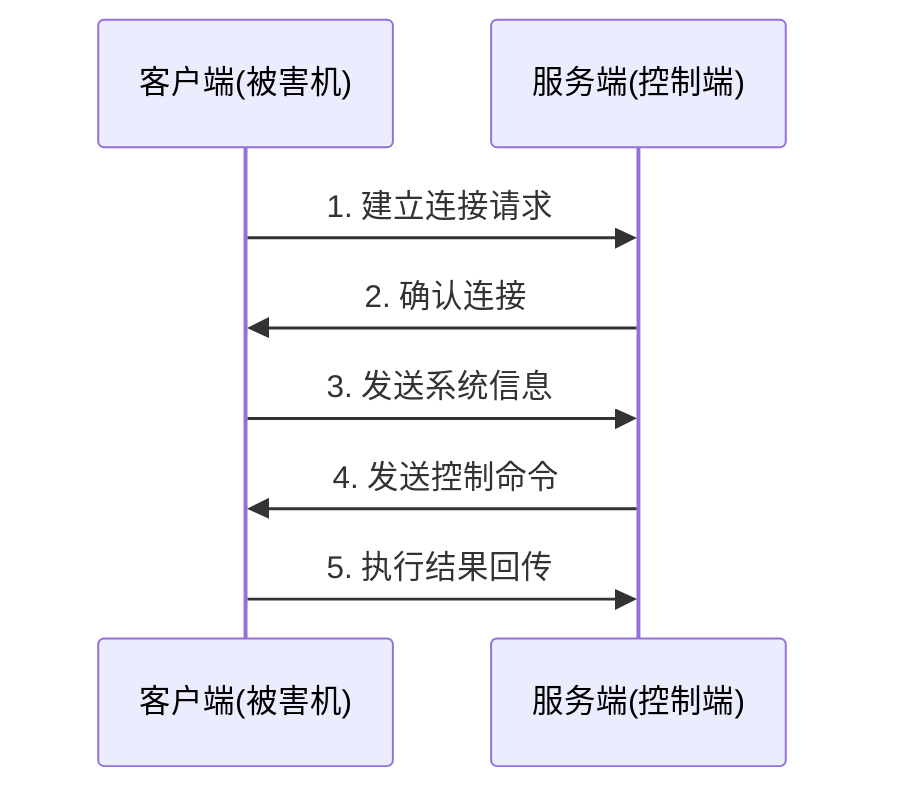

### 定义和内涵

- 伪装成正常文件，窃取数据。作用范围是所有使用有木马的人在使用电脑时的资料。
- 通常有两个可执行程序：控制端和被控制端
- 注重对主机的**控制**和运行的**隐蔽性**，悄悄地窃取数据
- 不会自我繁殖，也并不刻意地去感染

### 网络蠕虫、计算机病毒和木马的区别

![[Pasted image 20241226115959.png]]

### 木马的种类

- 破坏型
- 代理型
- FTP型
- 密码发送型
- 键盘记录型
- 远程访问型
- 下载型木马

### 木马的工作原理

本质上是一个C/S模式的程序

#### 通信过程

### 木马隐藏

- 集成到合法程序中
- 隐藏在配置文件中
- 潜伏在win.ini
- 伪装在普通文件中
- 内置到注册表中
- 在system.ini中藏身
- 隐形于启动组中
- 隐蔽在winstart.bat
- 捆绑在启动文件中
- 设置在超级连接中
- 注册为系统的服务程序